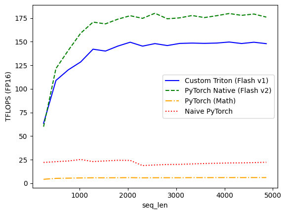

# Custom Flash Attention with OpenAI Triton

This repository contains a high-performance implementation of the Flash Attention mechanism using OpenAI Triton.

The project demonstrates how to implement fused GPU kernels in Python that significantly outperform standard PyTorch operations and rival optimized CUDA implementations (cuDNN/FlashAttention).

## Context and Motivation

Standard Self-Attention has a quadratic memory complexity O(N^2). For long sequences, the bottleneck is not the computation itself (FLOPs), but the memory bandwidth (IO). The standard implementation requires materializing a massive N x N attention matrix in the GPU's High Bandwidth Memory (HBM), which is slow.

**Flash Attention** solves this by being IO-aware. It uses **Tiling** to compute the attention mechanism block by block. By keeping intermediate results in the GPU's fast on-chip SRAM, it avoids writing the full attention matrix to the main memory.

## Implementation Details

This kernel is written in **Triton DSL** and implements the logic found in the original Flash Attention paper (V1).

- **Algorithm:** IO-aware Tiling + Online Softmax (safe tracking of maximums for numerical stability).
- **Precision:** Mixed Precision. The kernel loads FP16 inputs, performs critical accumulations (dot products and softmax reductions) in FP32 to ensure accuracy, and casts back to FP16 for storage.
- **Parallelization:** The kernel parallelizes computation over the Batch and Head dimensions.

## Performance Benchmarks

Benchmarks were conducted on an NVIDIA GPU using float16 precision. We compared this custom kernel against three PyTorch backends:
1. **Custom Triton:** This implementation.
2. **PyTorch Native:** The default highly optimized kernel (Flash Attention V2).
3. **PyTorch Math:** Enforced non-fused standard implementation.
4. **Naive PyTorch:** A manual python implementation.

## Benchmark Graph Analysis


*(Figure: TFLOPS performance (FP16) vs Sequence Length)*

The visual representation above highlights the critical impact of IO-aware tiling on GPU performance:

1.  **The Memory Wall:** The standard `PyTorch (Math)` and `Naive PyTorch` implementations (orange and red lines) flatline near the bottom. They are strictly memory-bound, spending most of their time moving the $N \times N$ matrix between HBM and compute units. Their performance is almost negligible compared to the fused kernels.

2.  **Flash Attention Saturation:** Both the `Custom Triton` (blue) and `PyTorch Native` (green) kernels show a steep initial rise as sequence length increases, quickly saturating the GPU's compute capabilities.
    - **PyTorch Native (Flash V2)** peaks and stabilizes around **180 TFLOPS**.
    - **Custom Triton (Flash V1)** stabilizes around **150 TFLOPS**.

3.  **The Gap:** The performance gap between the blue and green curves (approx. 15-20%) represents the optimization headroom available. This is primarily attributed to the parallelization strategy. Our current custom kernel parallelizes only across Batch and Heads (V1 logic). The Native V2 kernel additionally parallelizes across the sequence dimension, leading to better GPU occupancy and warp scheduling, especially for longer sequences.

| Sequence Length | Custom Triton (Flash v1) | PyTorch Native (Flash v2) | PyTorch (Math) | Naive PyTorch |
| :--- | :--- | :--- | :--- | :--- |
| **256** | 63.55 | 59.92 | 4.20 | 22.07 |
| **512** | 108.94 | 121.57 | 5.18 | 22.85 |
| **1024** | 128.56 | 159.02 | 5.65 | 25.19 |
| **2048** | 149.46 | 177.53 | 5.96 | 24.21 |
| **4096** | 149.67 | 179.85 | 6.04 | 21.56 |
| **4864** | 147.93 | 176.06 | 6.03 | 22.25 |

### Accuracy

Numerical accuracy was validated against the native PyTorch implementation using Mean Absolute Difference.
- **Average Difference:** 0.000199
- **Status:** Valid (within FP16 tolerance).

## Note on AI Usage

While the core Triton kernel logic and the implementation of the Flash Attention algorithm were developed manually to ensure deep understanding of the tiling and memory hierarchy concepts, AI tools were used to assist in writing the benchmarking boilerplate code (graphs, data collection) and structuring this documentation.

## Usage

```python
import torch
from flash_attn_triton import flash_attention

# Define inputs (FP16 recommended)
BATCH, HEADS, SEQ_LEN, D_HEAD = 4, 8, 1024, 64
dtype = torch.float16

q = torch.randn((BATCH, HEADS, SEQ_LEN, D_HEAD), dtype=dtype, device='cuda')
k = torch.randn((BATCH, HEADS, SEQ_LEN, D_HEAD), dtype=dtype, device='cuda')
v = torch.randn((BATCH, HEADS, SEQ_LEN, D_HEAD), dtype=dtype, device='cuda')
scale = 1.0 / (D_HEAD ** 0.5)

# Run kernel
output = flash_attention(q, k, v, sm_scale=scale)
